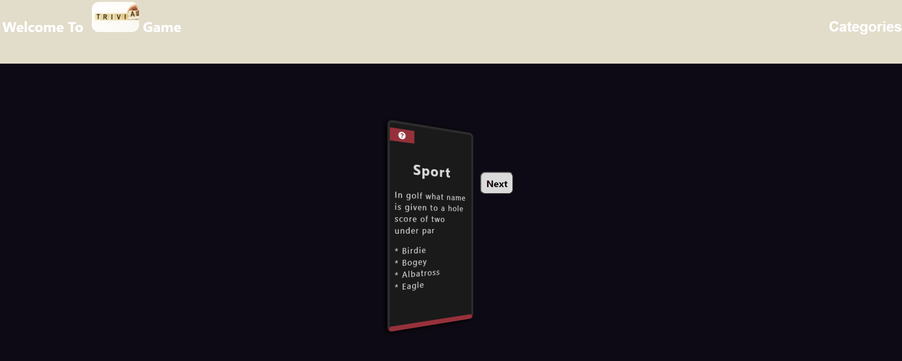

  [](https://shields.io/)
  [](https://shields.io/)
  
  
# Introduction:  Trivia Gamme

As you proceed in your career as a web developer, you will probably be asked to complete a coding assessment, which is typically a combination of multiple-choice questions and interactive challenges. Build a timed code quiz with multiple-choice questions. This app will run in the browser and feature dynamically updated HTML and CSS powered by your JavaScript code. It will also feature a clean and polished user interface and be responsive, ensuring that it adapts to multiple screen sizes.

## User Story

```
AS a USER I want to be able to play a trivia game. 
Build with react, using third party API to get a random questions. 
Styling with CSS only.
```

## Screenshot 




### Prerequisites

Visual Studio Code 

## Built With

- HTML5 
- CSS
- JavaScript
- React
- redux
- axios


## Authors

- Philip Kouchner
- Github link - https://github.com/PhilipK-webdev/TriviaGame
- gh-pages - https://philipk-webdev.github.io/TriviaGame/